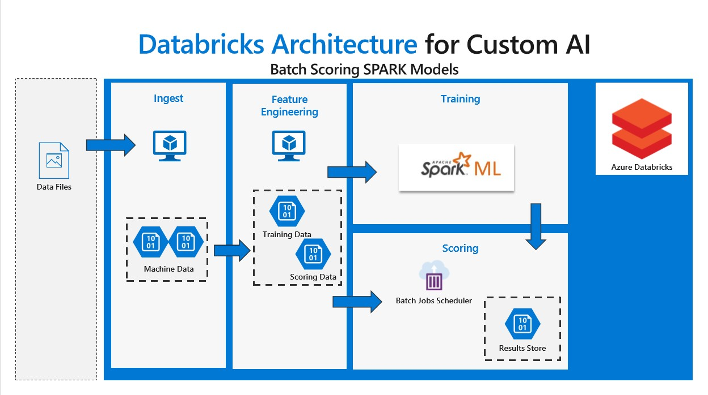

# Batch scoring of SPARK machine learning models 

## Overview

This scenario demonstrates batch scoring of a SPARK machine learning model on Azure Databricks. The model is constructed for a predictive maintenance scenario where we classify machine sensor readings into healthy or unhealthy and requiring maintenance for a set of four machine components. The resulting supervised multi-class model scores batches of new observations through a regularly scheduled Azure Databricks notebook tasks.

For this scenario, “Input Data” in the architecture diagram refers to a set of five simulated data sets related to realistic machine operating conditions. The solution uses methods from the PySpark MLlib machine learning library but the scoring process can be generalized to use any Python or R model hosted on Azure Databricks to make real-time predictions.

## Design

This solution uses the Azure Databricks service. We create jobs that set up the batch scoring demonstration. Each job executes a Databricks notebook to prepare the data and create the full solution.

 1. Ingest process downloads the simulated datasets from a GitHub site and converts and stores them as Spark dataframes on the Databricks DBFS.

 2. Feature engineering transorms and combines the data sets into an analysis dataset. The analysis data set can be targeted for training a model, or scoring data for a production pipeline. Each analysis dataset is also stored in the Databricks DBFS.

 3. Training process takes a subset of the complete data and constructs a model we can use to predict future outcomes. The model is stored in the Databricks DBFS for use by the scoring notebook.

 4. The scoring process uses a different subset of the data, including data not yet collected to predict the current and future state of the machine. The model results are stored back onto the Databricks DBFS.

# Prerequisites

We assume you have cloned the GitHub repository to your working compute instance (local computer or VM). The repository is located at: `https://github.com/Azure/BatchSparkScoringPredictiveMaintenance.git`

We will be using a Databricks command line utility (CLI) to automate many of these tasks. You should have a Python version installed. We require Python Version > 2.7.9 or > 3.6 for Databricks CLI requirements.

## Azure Databricks
This example is designed to run on Azure Databricks. You can provision the service through the Azure portal at:

https://ms.portal.azure.com/#create/Microsoft.Databricks

This particular example will run on the Standard pricing tier. 

## Databricks cluster

Once your Azure Databricks instance has been deployed, we can create a compute cluster. Launch your new workspace, select the *Clusters* icon. and Create a new cluster with Python Version 3.

## Databricks CLI

In order to avoid trying to explain how to execute the required steps in the Databricks UI, we will require the Databricks CLI available here:

https://github.com/databricks/databricks-cli

From a command line, you can pip install using 

`pip install --upgrade databricks-cli`

# Setup

## Connect the CLI

We need to connect the CLI to your databricks instance. This can be done using a Databricks generated [Authentication token](https://docs.databricks.com/api/latest/authentication.html#token-management).

Start from a command line, using the following command:

`databricks configure --token`

This will prompt you for your Azure Databricks hostname, which is the url portion of the web address from your browser. In eastus region, it will be `https://eastus.azuredatabricks.net/`. You will not use the POST arguments for the hostname (everything including and following the '?' character).

 You will also need an [Authentication token](https://docs.databricks.com/api/latest/authentication.html#token-management)

This operation will connect the CLI to this Databricks instance for all commands that follow.

## Import Notebooks

We next copy the scenario notebooks to the Databricks instance. We can do this with a single CLI command.

`databricks workspace import_dir [OPTIONS] SOURCE_PATH TARGET_PATH`

If you change into the local copy of the repository, your `SOURCE_PATH` will be the `notebooks` directory. The target path will include your user name, which you can get from the Azure Databricks UI, it should be related to your Azure AD email of the form `<uname@example.com>`. The `[TARGET_PATH]` will then be of the form `/Users/<uname@example.com>/notebooks`. 

The command should look like the following:

`databricks workspace import_dir notebooks /Users/<uname@example.com>/notebooks`

This will copy all required notebooks into the `notebooks` folder of your Azure Databricks Workspace.

## Get cluster Id

The final required piece of information is to find the cluster ID. We can only get this with the CLI with the following command:

`databricks clusters list`

`<cluster id>  <instance name>  <cluster status>`

The cluster ID is in the first field of the list. We will use this to point the Databricks Jobs to execute on a specific execute cluster.

# Steps

Instructions on where to go (first notebook or folder)

## Ingest data

`databricks jobs create --json-file jobs/01_CreateDataIngestion.json`

`databricks jobs run-now --job-id <jobID>`

## Feature engineering

`databricks jobs create --json-file jobs/02_CreateFeatureEngineering.json`

`databricks jobs run-now --job-id <jobID>`

We supply parameters using the `--notebook-params` command.

`databricks jobs run-now --job-id <jobID> --notebook-params {"FEATURES_TABLE":"testing_data","Start_Date":"2015-11-15","zEnd_Date":"2017-01-01"}`

On windows command line, we need to escape the double quotes:

`databricks jobs run-now --job-id <jobID> --notebook-params {\"FEATURES_TABLE\":\"testing_data\",\"Start_Date\":\"2015-11-15\",\"zEnd_Date\":\"2017-01-01\"}`

## Create the model

`databricks jobs create --json-file jobs/03_CreateModelBuilding.json`

`databricks jobs run-now --job-id <jobID>`

`databricks jobs run-now --job-id <jobID> --notebook-params {\"model\":\"DecisionTree\"}`

If you already have a SPARK model saved in Parquet format, you can copy using the CLI command `dbfs cp <SRC> <DST>`.

`dbfs cp  -r model.pqt dbfs:/storage/models/model.pqt`

## Load the scoring job

We need to create the data set we'll score using the Feature engineering job and a date range.

`databricks jobs run-now --job-id <jobID> --notebook-params {\"FEATURES_TABLE\":\"scoring_input\",\"Start_Date\":\"2015-12-30\",\"zEnd_Date\":\"2016-04-30\"}`

The load the scoring job

`databricks jobs create --json-file jobs/04_CreateModelScoring.json`

Then run the job.

`databricks jobs run-now --job-id <jobID>`

# Cleaning up

Where applicable, what does the user have to manually scrub to clean it.

# Contributing

This project welcomes contributions and suggestions.  Most contributions require you to agree to a
Contributor License Agreement (CLA) declaring that you have the right to, and actually do, grant us
the rights to use your contribution. For details, visit https://cla.microsoft.com.

When you submit a pull request, a CLA-bot will automatically determine whether you need to provide
a CLA and decorate the PR appropriately (e.g., label, comment). Simply follow the instructions
provided by the bot. You will only need to do this once across all repos using our CLA.

This project has adopted the [Microsoft Open Source Code of Conduct](https://opensource.microsoft.com/codeofconduct/).
For more information see the [Code of Conduct FAQ](https://opensource.microsoft.com/codeofconduct/faq/) or
contact [opencode@microsoft.com](mailto:opencode@microsoft.com) with any additional questions or comments.

### Author: 
John Ehrlinger <john.ehrlinger@microsoft.com>
